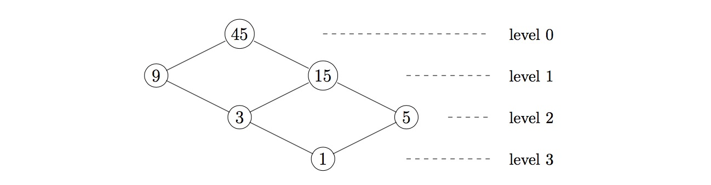

For a positive integer $n$ create a graph using its divisors as vertices. An edge is drawn between two vertices $a \lt b$ if their quotient $b/a$ is prime. The graph can be arranged into levels where vertex $n$ is at level $0$ and vertices that are a distance $k$ from $n$ are on level $k$. Define $g(n)$ to be the maximum number of vertices in a single level.

The example above shows that $g(45) = 2$. You are also given $g(5040) = 12$.

Find the smallest number, $n$, such that $g(n) \ge 10^4$.
