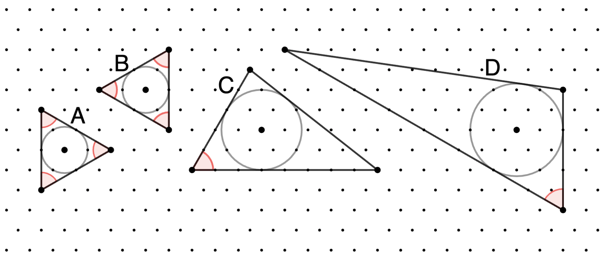

# 883 · 奇妙三角形

> 中文意译。英文原文见 [Project Euler Problem 883](https://projecteuler.net/problem=883)；抓取底稿见 `statement.en.md`。

在本题中，我们考虑画在正六边形格点上的三角形。平面上每个格点周围等间距分布着 $6$ 个相邻格点，间距均为 $1$。

如果一个三角形满足以下条件，则称其为**奇妙三角形**（remarkable triangle）：
- 三个顶点及其内心均落在格点上；
- 至少有一个内角为 $60^\circ$。

上图展示了四个奇妙三角形的例子，其中 $60^\circ$ 的角用红色标出。三角形 A 和 B 的内切圆半径为 $1$；C 的内切圆半径为 $\sqrt{3}$；D 的内切圆半径为 $2$。

定义 $T(r)$ 为内切圆半径 $\le r$ 的奇妙三角形的数量。旋转和反射（如上面的三角形 A 和 B）分别单独计数；但平移不重复计数——即在格点不同位置画出的同一三角形只计算一次。

已知 $T(0.5)=2$，$T(2)=44$ 以及 $T(10)=1302$。

求 $T(10^6)$。
