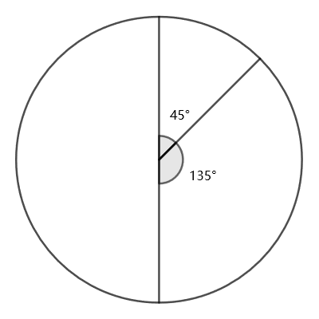

# 891 · 模糊的时钟

> 中文意译。英文原文见 [Project Euler Problem 891](https://projecteuler.net/problem=891)；抓取底稿见 `statement.en.md`。

一个圆形时钟只有三根指针：时针、分针、秒针。所有指针外观完全相同，且匀速连续转动。此外，钟面上没有任何数字或参考标记，因此“正上方位置”是未知的。该时钟的走时运转与普通的 12 小时制模拟钟完全相同。

尽管设计极不方便，但在大多数时刻，仅通过精确测量各指针之间的夹角，仍能确定正确的时刻（在 12 小时周期内）。例如，若三根指针完全重合，则该时刻必然是 12:00:00。

然而，在某些特定时刻，时钟会呈现歧义读数。例如，下图所示的时刻既可能是 1:30:00，也可能是 7:30:00（此时时钟整体旋转了 $180^\circ$）。因此 1:30:00 和 7:30:00 都是歧义时刻。
注意，即使有两根指针完全重合，我们仍能分辨出它们是处于同一位置的两根独立指针。因此例如 3:00:00 和 9:00:00 并不是歧义时刻。

在一个 12 小时周期内，总共有多少个歧义时刻？
