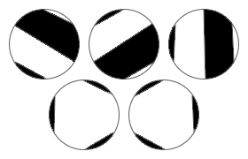

Consider a circle where $2n$ distinct points have been marked on its circumference.

A cutting $C$ consists of connecting the $2n$ points with $n$ line segments, so that no two line segments intersect, including on their end points. The $n$ line segments then cut the circle into $n + 1$ pieces. Each piece is painted either black or white, so that adjacent pieces are opposite colours. Let $d(C)$ be the absolute difference between the numbers of black and white pieces under the cutting $C$.

Let $D(n)$ be the sum of $d(C)$ over all different cuttings $C$. For example, there are five different cuttings with $n = 3$.

The upper three cuttings all have $d = 0$ because there are two black and two white pieces; the lower two cuttings both have $d = 2$ because there are three black and one white pieces. Therefore $D(3) = 0 + 0 + 0 + 2 + 2 = 4$. You are also given $D(100) \equiv 1172122931\pmod{1234567891}$.

Find $\displaystyle \sum_{n=1}^{10^7} D(n)$. Give your answer modulo $1234567891$.
