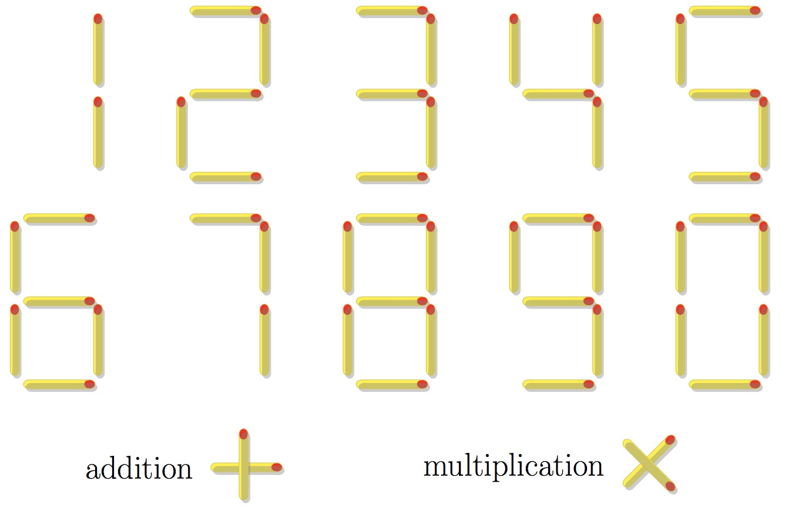

# 893 · 火柴棒算式

> 中文意译。英文原文见 [Project Euler Problem 893](https://projecteuler.net/problem=893)；抓取底稿见 `statement.en.md`。

定义 $M(n)$ 为表示数字 $n$ 所需的最少火柴棒根数。

一个数既可以用纯数字形式表示，也可以表示为包含加法和/或乘法的算式。算式必须遵守标准运算优先级（即乘法优先于加法）。不允许使用任何其他符号或运算，例如括号、减法、除法或乘方。

允许使用的有效数字与运算符号如下图所示：

例如，用纯数字形式表示 $28$ 需要 $12$ 根火柴棒，但将其表示为算式 $4\times 7$ 仅需 $9$ 根火柴棒；由于没有使用更少火柴棒的表示方法，因此 $M(28) = 9$。

定义：

$$
T(N) = \sum_{n=1}^N M(n)
$$

已知 $T(100) = 916$。

求 $T(10^6)$。
