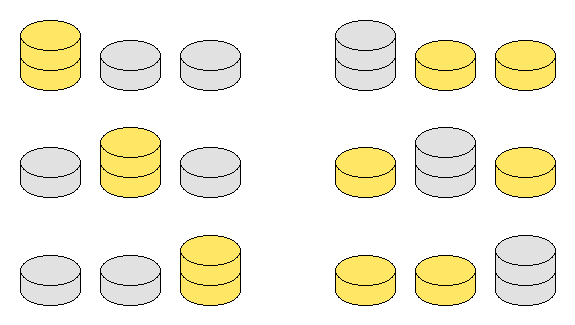

# 895 · 金银币博弈 II

> 中文意译。英文原文见 [Project Euler Problem 895](https://projecteuler.net/problem=895)；抓取底稿见 `statement.en.md`。

Gary 和 Sally 用摆成若干竖直硬币叠的金币和银币玩游戏，两人轮流操作。在 Gary 的回合，他选择一枚金币，并将该金币以及其上方压着的所有硬币一起移出游戏。Sally 在她的回合执行相同操作，但选择的是一枚银币。首个无法操作的玩家判负。

如果无论 Gary 还是 Sally 先手，在双方均采取最优策略的前提下先手均必败，则称该硬币排列是**公平的**（fair）。

如果金币总数与银币总数相等，则称该排列是**平衡的**（balanced）。

定义 $G(m)$ 为由三叠非空硬币叠组成的公平且平衡的排列数，其中每叠的高度均不超过 $m$。不同硬币叠的排列顺序视为不同，因此 $G(2)=6$，由以下 6 种排列给出：

已知 $G(5)=348$ 以及 $G(20)=125825982708$。

求 $G(9898)$，并将答案对 $989898989$ 取模。
