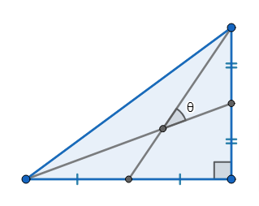

# 904 · 勾股中线夹角

> 中文意译。英文原文见 [Project Euler Problem 904](https://projecteuler.net/problem=904)；抓取底稿见 `statement.en.md`。

给定一个边长为整数的直角三角形，两条直角边上的中线所夹的较小锐角记为 $\theta$。

在所有边长为整数且斜边不超过 $L$ 的直角三角形中，设 $f(\alpha, L)$ 为使得 $|\theta - \alpha|$ 达到最小的直角三角形的三边长之和。
若有多个三角形同时达到最小值，则选取其中面积最大的三角形。本题中所有角度均以度（degree）为单位。

例如，$f(30,10^2)=198$ 且 $f(10,10^6)= 1600158$。

定义：

$$
F(N,L)=\sum_{n=1}^{N}f\left(\sqrt[3]{n},L\right)
$$

已知 $F(10,10^6)= 16684370$。

求 $F(45000, 10^{10})$。
