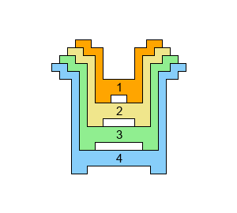
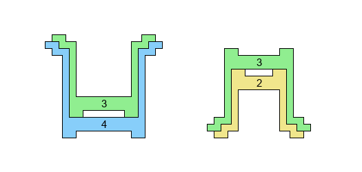
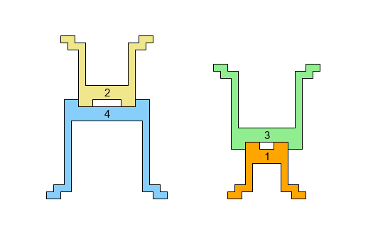
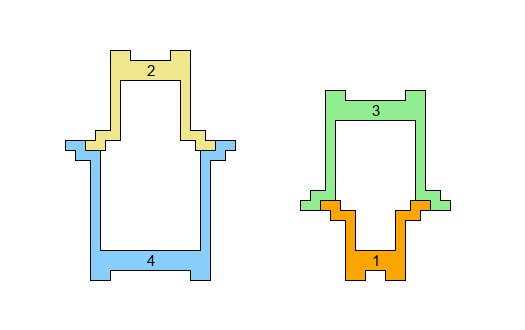
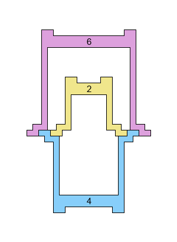

# 907 · 套杯叠塔

> 中文意译。英文原文见 [Project Euler Problem 907](https://projecteuler.net/problem=907)；抓取底稿见 `statement.en.md`。

一套婴儿玩具有 $n$ 个杯子，按尺寸从小到大标记为 $C_1,\dots,C_n$。

杯子可以按不同的组合和朝向堆叠成塔。杯子的形状允许以下堆叠方式：

**嵌套（Nesting）**：$C_k$ 可以正向严丝合缝地套在 $C_{k+1}$ 内部。

**底对底（Base-to-base）**：$C_{k+2}$ 或 $C_{k-2}$ 可以口朝上正置，底朝下地叠在倒扣（口朝下）的 $C_k$ 底部之上，两者杯底严丝合缝地吻合。

**口对口（Rim-to-rim）**：$C_{k+2}$ 或 $C_{k-2}$ 可以倒扣（口朝下），叠在口朝上的 $C_k$ 杯口之上，两者杯口严丝合缝地吻合。

在本题的规则中，不允许同时将 $C_{k+2}$ 和 $C_{k-2}$ 口对口叠在 $C_k$ 之上（尽管示意图看起来好像允许这么做）：

定义 $S(n)$ 为按照上述规则使用全部 $n$ 个杯子搭建单座塔的方法数。
已知 $S(4)=12$，$S(8)=58$ 以及 $S(20)=5560$。

求 $S(10^7)$，并将答案对 $1\,000\,000\,007$ 取模。
