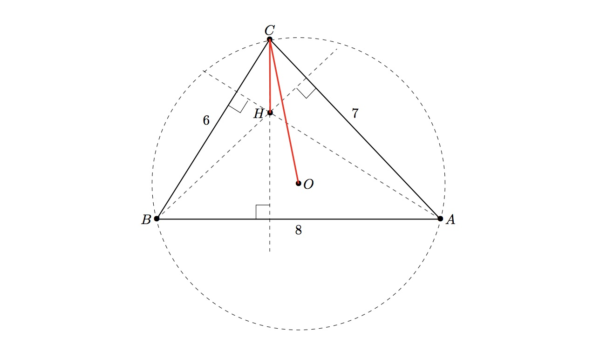

# 919 · 幸运三角形

> 中文意译。英文原文见 [Project Euler Problem 919](https://projecteuler.net/problem=919)；抓取底稿见 `statement.en.md`。

如果一个三角形的三边长均为整数，且至少有一个顶点满足：该顶点到三角形垂心的距离恰好等于该顶点到外心距离的一半，则称该三角形为**幸运三角形**。

上图所示的三角形 $ABC$ 是一个幸运三角形的例子，其边长为 $(6,7,8)$。顶点 $C$ 到外心 $O$ 的距离约为 $4.131182$，而从 $C$ 到垂心 $H$ 的距离恰好为其一半，约为 $2.065591$。

定义 $S(P)$ 为所有边长满足 $a\le b\le c$ 且周长不超过 $P$ 的幸运三角形的周长 $a+b+c$ 之和。

例如 $S(10)=24$，来自边长为 $(1,2,2)$、$(2,3,4)$ 和 $(2,4,4)$ 的三个三角形。已知 $S(100)=3331$。

求 $S(10^7)$。
