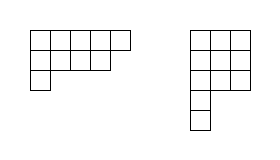
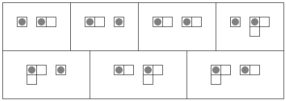

# 923 · 杨氏博弈 B

> 中文意译。英文原文见 [Project Euler Problem 923](https://projecteuler.net/problem=923)；抓取底稿见 `statement.en.md`。

杨图（Young diagram）是由网格状排列的（等大）正方形行和列组成的有限集合，满足：
- 所有行最左侧的正方形在垂直方向上对齐；
- 所有列最顶部的正方形在水平方向上对齐；
- 从上往下，各行的长度单调不增；
- 从左往右，各列的长度单调不增。

下图展示了两个杨图的示例：

两位玩家 Right（向右方）和 Down（向下方）在若干个互不相连的杨图上玩一个游戏。初始时，每个杨图的左上角方格中各放置一枚棋子。随后两人轮流移动，Right 先手。
- 在 Right 的回合，Right 选择其中一个杨图上的棋子，并将其向右移动恰好一格。
- 在 Down 的回合，Down 选择其中一个杨图上的棋子，并将其向下移动恰好一格。
- 轮到某位玩家时，若无法做出合法移动，则该玩家输掉游戏。

对于正整数 $a, b, k \ge 1$，我们将右下边界由 $k$ 个台阶构成的杨图定义为 $(a, b, k)$-阶梯图，其中每个台阶的垂直高度为 $a$、水平长度为 $b$。下图展示了四种阶梯图，参数 $(a, b, k)$ 分别为 $(1, 1, 4)$、$(5, 1, 1)$、$(3, 3, 2)$ 和 $(2, 4, 3)$：

此外，定义 $(a, b, k)$-阶梯图的权值为 $a + b + k$。

设 $S(m, w)$ 表示选取 $m$ 个权值不超过 $w$ 的阶梯图、且在双方均采取最优策略的前提下先手方 Right 必胜的方案数。同一组阶梯图的不同排列顺序视为不同方案。

例如，$S(2, 4) = 7$，如下图所示，棋子初始位置以灰色圆圈标出：

已知 $S(3, 9) = 315319$。

求 $S(8, 64) \bmod (10^9 + 7)$。
