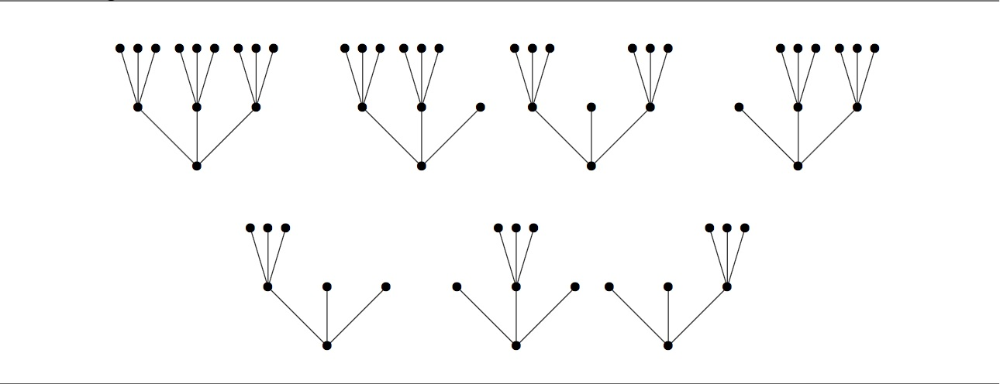

# 927 · 素元树

> 中文意译。英文原文见 [Project Euler Problem 927](https://projecteuler.net/problem=927)；抓取底稿见 `statement.en.md`。

满 $k$ 叉树是指具有单一根节点、且每个节点要么是叶节点、要么恰好具有 $k$ 个有序子节点的树。$k$ 叉树的高度定义为从根节点到叶节点的最长路径上的边数。

例如，高度为 $0$ 的满 3 叉树有 1 棵；高度为 $1$ 的满 3 叉树有 1 棵；高度为 $2$ 的满 3 叉树共有 7 棵，如下图所示：

对于整数 $n \ge 0$ 和 $k \ge 2$，定义 $t_k(n)$ 为高度不超过 $n$ 的满 $k$ 叉树的数目。
因此，$t_3(0) = 1$，$t_3(1) = 2$，$t_3(2) = 9$。类似地，$t_2(0) = 1$，$t_2(1) = 2$，$t_2(2) = 5$。

定义 $S_k$ 为所有能整除某个 $t_k(n)$（$n \ge 0$）的正整数 $m$ 的集合。例如由上述数值可知，$1, 2, 5 \in S_2$，且 $1, 2, 3, 9 \in S_3$。

设集合：

$$
S = \bigcap_p S_p
$$

其中对所有素数 $p$ 取交集。最后，定义 $R(N)$ 为 $S$ 中所有不超过 $N$ 的元素之和。已知 $R(20) = 18$ 且 $R(1000) = 2089$。

求 $R(10^7)$。
