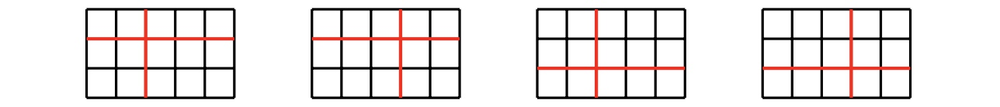

Starting with one piece of integer-sized rectangle paper, two players make moves in turn.
A valid move consists of choosing one piece of paper and cutting it both horizontally and vertically, so that it becomes four pieces of smaller rectangle papers, all of which are integer-sized.
The player that does not have a valid move loses the game.

Let $C(w, h)$ be the number of winning moves for the first player, when the original paper has size $w \times h$. For example, $C(5,3)=4$, with the four winning moves shown below.

Also write $\displaystyle D(W, H) = \sum_{w = 2}^W\sum_{h = 2}^H C(w, h)$. You are given that $D(12, 123) = 327398$.

Find $D(123, 1234567)$.
