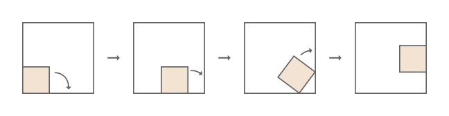

A square of side length $b<1$ is rolling around the inside of a larger square of side length $1$, always touching the larger square but without sliding.
Initially the two squares share a common corner. At each step, the small square rotates clockwise about a corner that touches the large square, until another of its corners touches the large square. Here is an illustration of the first three steps for $b = \frac5{13}$.

For some values of $b$, the small square may return to its initial position after several steps. For example, when $b = \frac12$, this happens in $4$ steps; and for $b = \frac5{13}$ it happens in $24$ steps.

Let $F(N)$ be the number of different values of $b$ for which the small square first returns to its initial position within at most $N$ steps. For example, $F(6) = 4$, with the corresponding $b$ values:

$$
\frac12,\quad 2 - \sqrt 2,\quad 2 + \sqrt 2 - \sqrt{2 + 4\sqrt2},\quad  8 - 5\sqrt2 + 4\sqrt3 - 3\sqrt6,
$$

the first three in $4$ steps and the last one in $6$ steps. Note that it does not matter whether the small square returns to its original orientation.
Also $F(100) = 805$.

Find $F(10^8)$.
