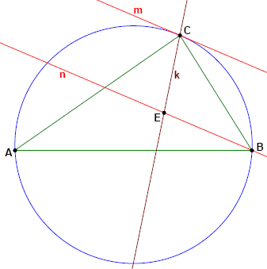

# 962 · 角平分线与切线 2

> 中文意译。英文原文见 [Project Euler Problem 962](https://projecteuler.net/problem=962)；抓取底稿见 `statement.en.md`。

给定边长均为整数的三角形 $ABC$，满足 $BC \le AC \le AB$。
$k$ 是角 $\angle ACB$ 的角平分线。
$m$ 是三角形 $ABC$ 的外接圆在点 $C$ 处的切线。
$n$ 是一条过点 $B$ 且平行于 $m$ 的直线。
直线 $n$ 与直线 $k$ 的交点记为 $E$。

周长不超过 $1\,000\,000$ 且线段 $CE$ 的长度为整数的三角形 $ABC$ 共有多少个？

注：本题是[第 296 题](https://projecteuler.net/problem=296)的更难版本。请仔细注意两个题目描述之间的差异。
