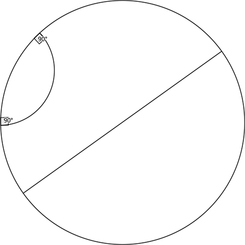

# 972 · 双曲平面

> 中文意译。英文原文见 [Project Euler Problem 972](https://projecteuler.net/problem=972)；抓取底稿见 `statement.en.md`。

双曲平面可用开单位圆盘表示，即 $\mathbb{R}^2$ 中满足 $x^2 + y^2 < 1$ 的点集 $(x, y)$。

测地线定义为该开单位圆盘的一条直径，或是包含在圆盘内且与圆盘边界正交的圆弧。
下图展示了双曲平面及其上的两条测地线：一条为直径，另一条为圆弧。

设 $\mathcal{V}(N)$ 为满足 $x^2 + y^2 < 1$ 且 $x, y$ 均为分母不超过 $N$ 的有理数的点集 $(x, y)$。

设 $T(N)$ 为使得 $P, Q, R$ 是 $\mathcal{V}(N)$ 中三个互不相同的点、且存在一条双曲直线同时穿过它们的有序三元组 $(P, Q, R)$ 的数量。
已知 $T(2) = 24$ 以及 $T(3) = 1296$。

求 $T(12)$。
