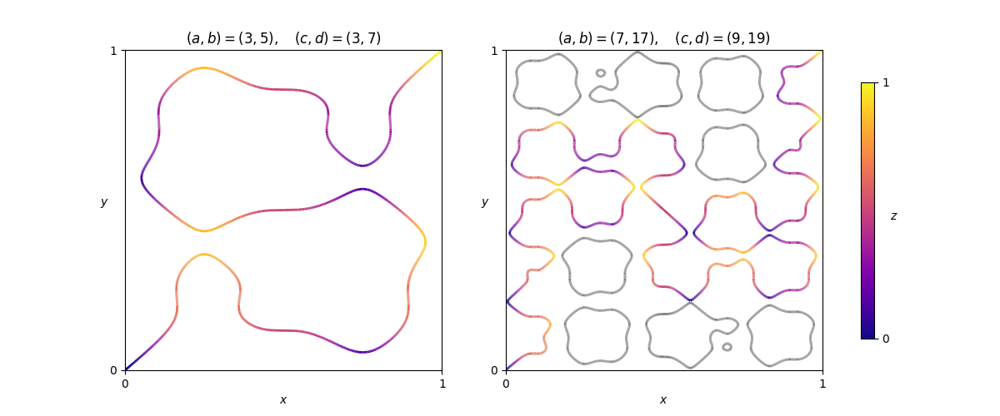

Given a pair $(a,b)$ of coprime odd positive integers, define the function

$$
H_{a,b}(x)=\frac{1}{2}-\frac{1}{2(a+b)}\Bigl(b\cos(a\pi x)+a\cos(b\pi x)\Bigr)
$$

It can be seen that $H_{a,b}(0)=0$, $H_{a,b}(1)=1$, and $0 < H_{a,b}(x) < 1$ for all $x$ strictly between $0$ and $1$.

Given two such pairs $(a,b)$ and $(c,d)$, paths of infinitesimal width traverse the unit cube internally through every point $(x,y,z)\in [0,1]^3$ such that $z=H_{a,b}(x)=H_{c,d}(y)$. Remarkably, it can be shown that the point $(0,0,0)$ is always connected to the opposite corner $(1,1,1)$. Furthermore, with the additional condition $\gcd(a+b,c+d)\in\{2,4\}$, it can be shown that there is exactly one path connecting the two points.

Shown above are two examples, as viewed from above the cube. That is, we see the paths projected onto the $xy$-plane, with corresponding $z$ values indicated with varying colour. In the second example some paths are coloured grey to indicate that, while they exist, they do not form part of the path from $(0,0,0)$ to $(1,1,1)$.

Define $F(a, b, c, d)$ to be the sum of the absolute changes in height (or $z$-coordinate) over all uphill and downhill sections of the path from $(0,0,0)$ to $(1,1,1)$. In the first example above, the path climbs $\approx4.00886$ over eleven uphill sections, and descends $\approx3.00886$ over ten downhill sections, giving $F(3,5,3,7)\approx7.01772$. You are also given $F(7,17,9,19)\approx 26.79578$.

Let $G(m, n)$ be the sum of $F(p,q,p,2q-p)$ over all pairs $(p,q)$ of primes, $m\leq p < q\leq n$. You are given $G(3, 20)\approx463.80866$.

Find $G(500,1000)$ giving your answer rounded to five digits after the decimal point.
