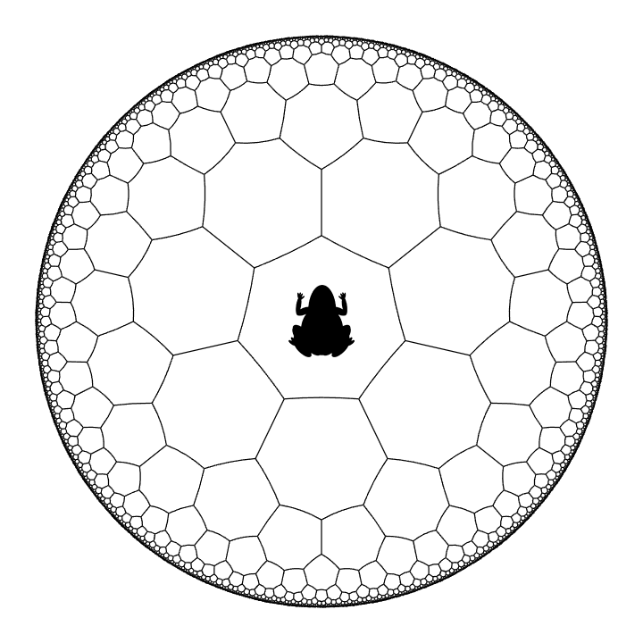

# 979 · 七边形跳跃

> 中文意译。英文原文见 [Project Euler Problem 979](https://projecteuler.net/problem=979)；抓取底稿见 `statement.en.md`。

用开单位圆盘表示的双曲平面可以用七边形进行密铺。每个密铺单元都是一个双曲正七边形（即它具有七条边，每条边都是双曲平面中的测地线段），且每个顶点恰由三个七边形共享。
有关部分定义请参考[第 972 题](https://projecteuler.net/problem=972)。

下图展示了这种密铺结构的示意图：

现在，一只双曲青蛙从如图所示的某个七边形出发。每一步它可以跳到与之相邻的七个七边形单元中的任意一个。

定义 $F(n)$ 为青蛙跳跃 $n$ 步后恰好回到出发七边形的路径总数。
已知 $F(4) = 119$。

求 $F(20)$。
