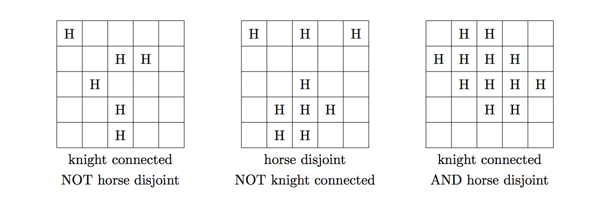

# 984 · 骑士与马

> 中文意译。英文原文见 [Project Euler Problem 984](https://projecteuler.net/problem=984)；抓取底稿见 `statement.en.md`。

在国际象棋中，马（骑士，knight）的走法为水平走两格竖直走一格，或水平走一格竖直走两格，并且可以越过途中的任何棋子。

在中国象棋中有一种相似的棋子称为马（horse），其位移与国际象棋的骑士完全相同；但中国象棋的马不能越过中间的棋子（即“蹩马腿”）。

具体而言，中国象棋中马的走法分为两步：先沿正交方向走一格，再沿同一正交方向朝对角线方向走一格。若第一步的正交格子上已有棋子，则马不能朝该方向移动。

具体如上图所示，当棋盘中心有一匹马时，只要格子 $a_{1},a_{2},a_{3},a_{4}$ 为空，马就可以移动到格子 $b_{11},b_{12},b_{21},b_{22},b_{31},b_{32},b_{41},b_{42}$。例如，若格子 $a_2$ 上有棋子，则马不能移动到 $b_{21}$ 或 $b_{22}$。

如果棋盘上的一个格子集合满足：国际象棋骑士仅在集合内的格子上进行合法移动，就能在集合内的任意两个格子之间互达，则称该集合是**骑士连通的**（knight-connected）。
如果在集合中的每个格子上各放置一匹中国象棋马（其余格子均为空），没有任何一匹马能攻击到其他任意一匹马，则称该格子集合是**马互不攻击的**（horse-disjoint）。

设 $f(N)$ 为 $N\times N$ 棋盘上既是骑士连通、又是马互不攻击的非空子集数量。例如 $f(3) = 9$，对应 9 个单元素集合。已知 $f(5) = 903$，$f(100) = 8658918531876$，以及 $f(10000) \equiv 377956308 \bmod (10^9+7)$。

求 $f(10^{18})$ 对 $10^9+7$ 取模的结果。
