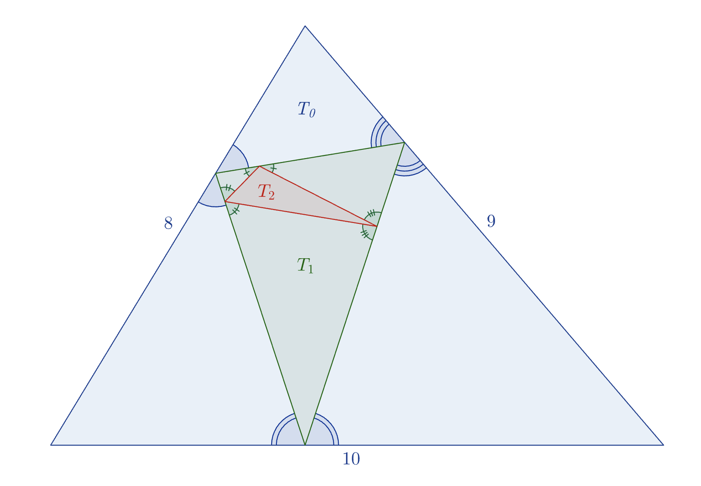

Given a triangle $T_k$, it is sometimes possible to construct a triangle $T_{k+1}$ inside $T_k$ such that

The three vertices of $T_{k+1}$ lie one on each side of $T_k$.
For each side of $T_k$, the angles formed between it and the two sides of $T_{k+1}$ it touches are equal to each other.

Illustrated above is such a sequence of three triangles starting with $T_0$ (in blue) having side lengths $(8,9,10)$. Then $T_1$ is shown in green and $T_2$ in red. However, no triangle can be drawn inside $T_2$ that satisfies the requirements. In other words, $T_3$ does not exist.

Amongst all integer-sided triangles $T_0$ such that $T_2$ exists but $T_3$ does not exist, the smallest possible perimeter is $10$ when $T_0$ has side lengths $(3, 3, 4)$.

Suppose another triangle $T_0$ has integer side lengths, and $T_{20}$ exists, but $T_{21}$ does not exist. What is the smallest possible perimeter of $T_0$?
