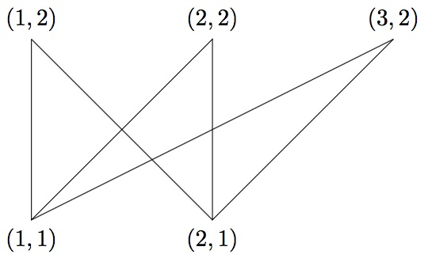

Given positive integers $m$ and $n$, for every $1\leq i \leq m$ and $1\leq j \leq n$ a line segment is drawn between points $(i,1)$ and $(j,2)$ in the plane. Then define $T(m,n)$ to be the number of triangles in the resulting picture, including those which are cut by other line segments.

Shown above is the example $m=2$, $n=3$, where eight triangles can be seen: four "smaller" triangles that are internally empty, and four "larger" triangles that are cut by another line segment. Thus $T(2,3)=8$.

You are also given $T(3,5)=146$ and $T(12,23)=756716$.

Find $T(1234\times 10^8,2345\times 10^8)$. Give your answer modulo $10^9+7$.
