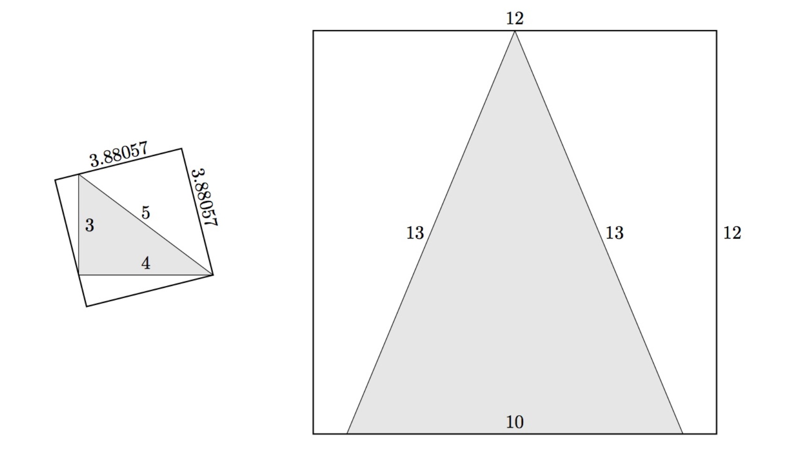

# 998 · 三角形外接正方形

> 中文意译。英文原文见 [Project Euler Problem 998](https://projecteuler.net/problem=998)；抓取底稿见 `statement.en.md`。

三角形的**最小包围正方形**是指能够完全覆盖该三角形的最小正方形。

上图展示了两个示例：$(3,4,5)$ 三角形的最小包围正方形边长约为 $3.88057$，不是整数；而 $(10,13,13)$ 三角形的最小包围正方形边长为 $12$，是一个整数。

定义 $T(n)$ 为最小包围正方形边长为整数且不超过 $n$ 的所有互不全等的整边长三角形的周长之和。

已知 $T(40)=346$，$T(400)=76402$ 以及 $T(2000)=3237036$。

求 $T(10^6)$。
